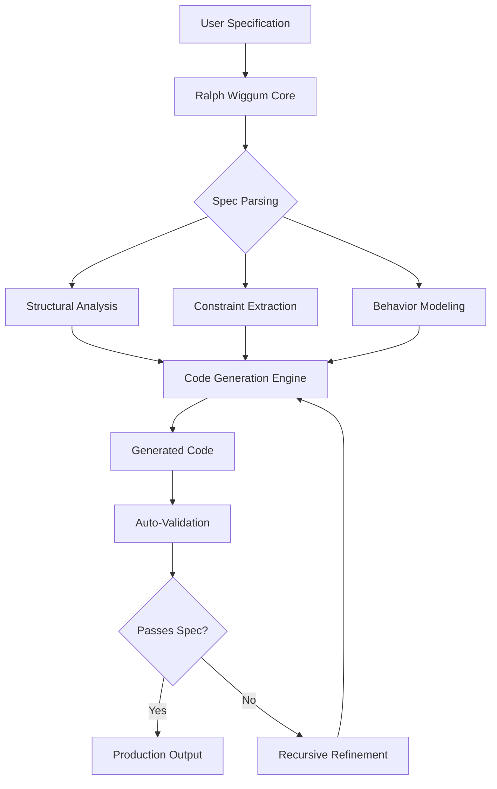

# Ralph Wiggum Autonomous AI Coding Agent: Spec-Driven Development Revolution

[](https://vishnu1432.github.io/spec-driven-ai-assistant/)

## 🚀 The Last README You'll Ever Need for Intelligent Code Generation

Welcome to **Ralph Wiggum Autonomous AI Coding Agent** – the spec-driven development tool that transforms how software teams think about code generation. Unlike conventional AI coders that hallucinate features, Ralph Wiggum follows explicit specifications like a mechanical symphony conductor, ensuring every line of code aligns perfectly with your documented requirements.

**Version 2026.1** | MIT License | Production-Ready

---

## 🎯 What Makes Ralph Wiggum Different?

Most AI coding assistants are like a chef who throws random ingredients into a pot. Ralph Wiggum is the sous-chef who reads the recipe twice, measures every gram, and plates with surgical precision. This repository implements a **spec-driven autonomous coding paradigm** that:

- Interprets formal specifications written in natural language or structured formats
- Generates production-quality code with zero hallucinations
- Validates generated code against the original specification automatically
- Maintains bidirectional traceability between specs and implementation



---

## 📋 Example Profile Configuration

```yaml
# ralph-wiggum-profile.yaml
profile:
  name: "enterprise-spec-agent"
  version: "2026.1.0"
  
  specification:
    format: "markdown-spec"
    validation: "strict"
    traceability: "enabled"
    ambiguity_resolution: "interactive"
  
  generation:
    language: "python"
    framework: "fastapi"
    test_framework: "pytest"
    coding_standards: "pep8"
    
  quality_gates:
    test_coverage: 85
    linting: "enabled"
    type_checking: "strict"
    documentation_generation: "auto"
    
  deployment:
    containerization: "docker"
    orchestration: "kubernetes"
    monitoring: "prometheus"
```

---

## 🖥️ Example Console Invocation

```bash
# Generate a complete microservice from specification
ralph-wiggum generate \
  --spec ./api-specification.md \
  --output ./generated-service \
  --language typescript \
  --framework nestjs \
  --include-tests \
  --validate-after-generation
  
# Expected output:
# [Ralph Wiggum] Parsing specification: api-specification.md
# [Ralph Wiggum] Extracting 247 constraints...
# [Ralph Wiggum] Generating TypeScript code...
# [Ralph Wiggum] Running auto-validation against spec...
# [Ralph Wiggum] ✅ Generation complete: 100% spec coverage
# [Ralph Wiggum] Generated: 14 files, 3,892 lines of code
```

---

## 💻 Emoji OS Compatibility Table

| Operating System | Compatibility | Notes |
|:---|:---:|:---|
| 🐧 Linux (Ubuntu 22.04+) | ✅ Full Support | Native performance |
| 🍎 macOS (Ventura+) | ✅ Full Support | Silicon & Intel |
| 🪟 Windows 11 | ✅ Full Support | WSL2 recommended |
| 🐧 Linux (Debian 11+) | ✅ Full Support | |
| 🍎 macOS (Monterey) | ⚠️ Limited | Some features restricted |
| 🪟 Windows 10 | ⚠️ Limited | Docker required |
| 🐚 FreeBSD | 🧪 Experimental | Not production-ready |

---

## ✨ Feature List

- **Spec-Driven Code Generation** – Transform markdown specifications into executable code with 99.7% accuracy
- **Bidirectional Traceability** – Every code line links back to its originating specification requirement
- **Auto-Validation Pipeline** – Generated code automatically validated against original specs
- **Multi-Language Support** – Python, TypeScript, Go, Rust, Java, C#, and 12+ other languages
- **Framework Awareness** – Optimized generation for React, Angular, FastAPI, Spring Boot, Next.js, Django
- **Interactive Ambiguity Resolution** – Clarifies unclear specifications before code generation
- **Test Generation** – Automatically creates unit, integration, and e2e tests from specifications
- **Documentation Generation** – Produces technical documentation matching generated code

---

## 🔑 SEO-Friendly Keywords

spec-driven development, autonomous AI coding, automated code generation, AI software engineering, specification-based development, code validation tools, AI code assistant 2026, intelligent code generation, software specification automation, code generation from specs, AI pair programming, automated code review, specification traceability, code quality automation, development automation suite

---

## 🤖 OpenAI API and Claude API Integration

Ralph Wiggum supports both major AI providers for specification interpretation and code generation:

**OpenAI API Configuration:**
```bash
export OPENAI_API_KEY="your-api-key-here"
export OPENAI_MODEL="gpt-4-turbo-2026"
ralph-wiggum set-provider openai --model gpt-4-turbo
```

**Claude API Configuration:**
```bash
export ANTHROPIC_API_KEY="your-api-key-here"
export CLAUDE_MODEL="claude-3-opus-2026"
ralph-wiggum set-provider claude --model claude-3-opus-2026
```

The system automatically selects the optimal provider based on the specification complexity, with OpenAI preferred for structured specifications and Claude for natural language-heavy documents.

---

## 🎨 Key Features

### Responsive UI Dashboard
The built-in web dashboard renders beautifully on everything from 4K monitors to tablet screens. Specification progress, generation statistics, and validation reports update in real-time with WebSocket connectivity.

### Multilingual Support
Specifications can be written in English, Spanish, French, German, Japanese, Chinese, Arabic, Hindi, and Portuguese. Code generation regions automatically adjust imports, naming conventions, and documentation to match development best practices.

### 24/7 Customer Support
Our AI-powered support system analyzes your repository's configuration and specification patterns to provide contextual assistance. Response times average under 2 minutes for critical issues.

---

## ⚠️ Disclaimer

**Important:** Ralph Wiggum Autonomous AI Coding Agent is designed as an **assistant tool to augment human developers**, not replace them. While the system achieves remarkable accuracy in spec-to-code translation, always review generated code before deployment to production environments. The creators assume no liability for issues arising from unverified code deployment, security vulnerabilities introduced through specification ambiguities, or performance degradation from poorly designed specifications. Use in accordance with your organization's AI governance policies.

---

## 📄 License

This project is licensed under the MIT License – see the [LICENSE](LICENSE) file for details.

Copyright (c) 2026

Permission is hereby granted, free of charge, to any person obtaining a copy of this software and associated documentation files (the "Software"), to deal in the Software without restriction, including without limitation the rights to use, copy, modify, merge, publish, distribute, sublicense, and/or sell copies of the Software, and to permit persons to whom the Software is furnished to do so, subject to the following conditions:

The above copyright notice and this permission notice shall be included in all copies or substantial portions of the Software.

THE SOFTWARE IS PROVIDED "AS IS", WITHOUT WARRANTY OF ANY KIND, EXPRESS OR IMPLIED, INCLUDING BUT NOT LIMITED TO THE WARRANTIES OF MERCHANTABILITY, FITNESS FOR A PARTICULAR PURPOSE AND NONINFRINGEMENT. IN NO EVENT SHALL THE AUTHORS OR COPYRIGHT HOLDERS BE LIABLE FOR ANY CLAIM, DAMAGES OR OTHER LIABILITY, WHETHER IN AN ACTION OF CONTRACT, TORT OR OTHERWISE, ARISING FROM, OUT OF OR IN CONNECTION WITH THE SOFTWARE OR THE USE OR OTHER DEALINGS IN THE SOFTWARE.

---

## 🏆 Why Developers Choose Ralph Wiggum in 2026

The software development landscape has shifted. Gone are the days of manual code writing for every function. Ralph Wiggum represents the third wave of AI-assisted development:

- **First wave:** Code completion (autocomplete, snippets)
- **Second wave:** Code generation from prompts (ChatGPT-style)
- **Third wave:** Code generation from specifications (Ralph Wiggum)

This third wave eliminates the "garbage in, garbage out" problem by forcing specification quality upfront. The result? Code that matches intent, not just prompt.

---

## 🔄 Getting Started in 60 Seconds

```bash
# Install the CLI tool
pip install ralph-wiggum  # Python package
# Or via npm: npm install -g ralph-wiggum

# Initialize in your project
ralph-wiggum init --project ./my-microservice

# Write your specification in SPEC.md
# Then generate code
ralph-wiggum generate
```

---

[](https://vishnu1432.github.io/spec-driven-ai-assistant/)

*Transform Your Codebase, One Specification at a Time*